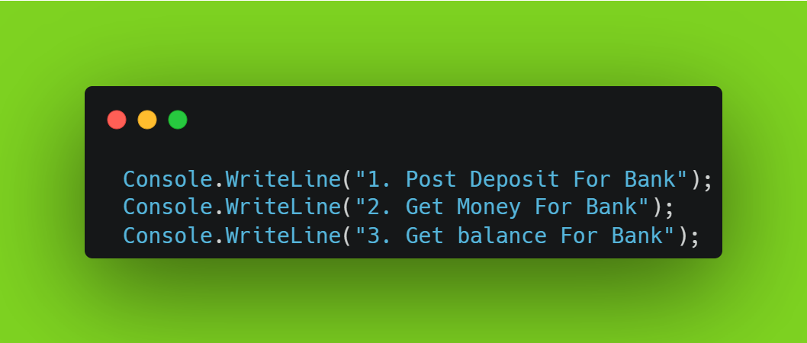
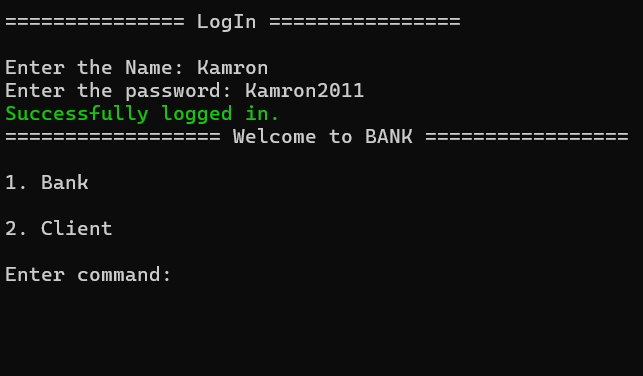
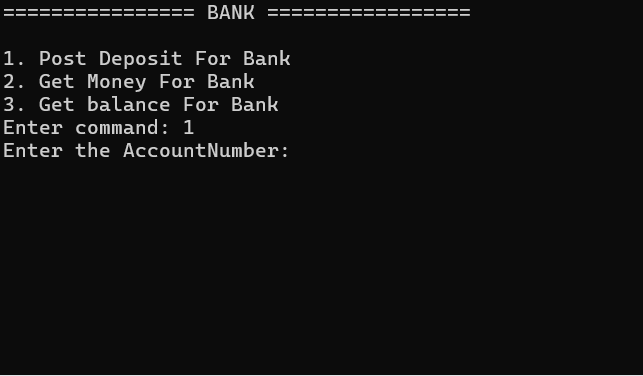
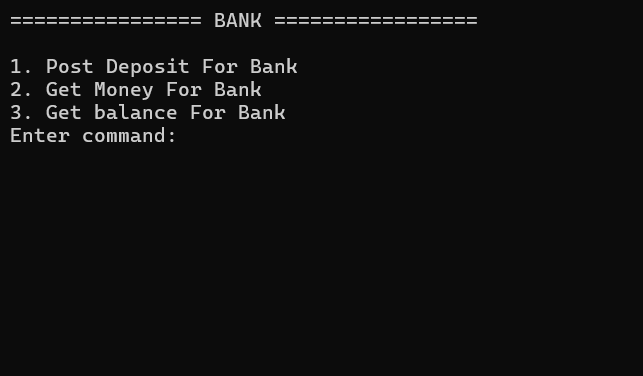
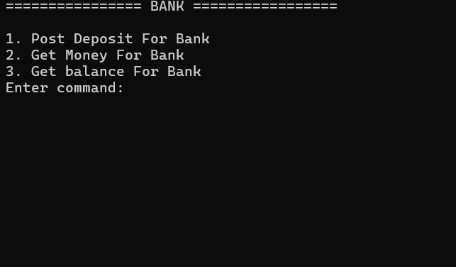
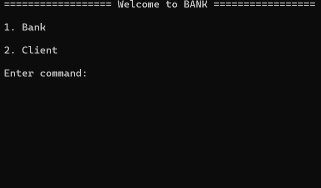

# Here you can build applications for the Bank.
In this project, you can learn about opening an account for the Bank, transferring money to the account and the amount of money in the Bank's account.

## MENU
 

## 1. Post Deposit For Bank
#### 1.1 You can open an account in the Bank in this section.

#### 1.2 In this section, you can view errors in opening an account at the Bank.

## 2. Get Money For Bank
#### 2.1 In this section, you can set up a withdrawal from a bank account.

#### 2.2 In this section, you can see the error in withdrawing money from the bank account.

## 3. Get balance For Bank

#### 3.1 In this section, you can find out the amount of money in the balance of the Bank account.

#### 3.2 In this section, when you find out the amount of money in the balance of the Bank account, an error will occur if you enter the account number incorrectly.

