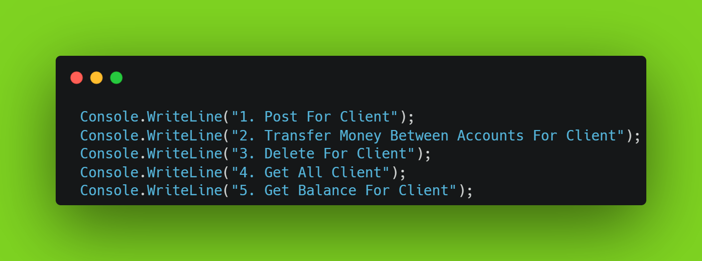
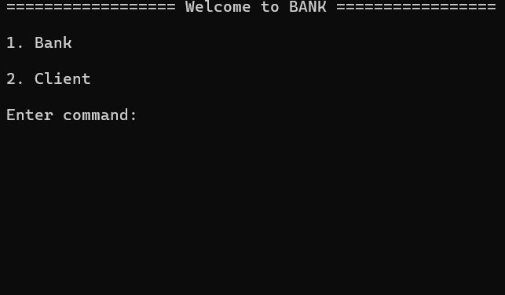
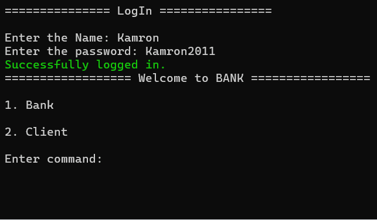
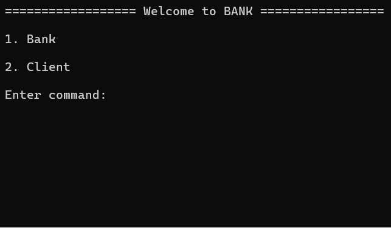

# Here you can perform the necessary actions for the Bank's Client.
In this project, you can open an account number for the Client, transfer money between two clients, and manage the balance of the clients.

## MENU

## 1. Post For Client

#### 1.1 In this section you can open an account for the Client.

#### 1.2 If you enter the Client information incorrectly, it will give an error.

## 2. Transfer Money Between Accounts For Client

#### 2.1 In this section, you can transfer money from two accounts to each other.

#### 2.2 In this section, when you transfer money from two accounts to each other, if you enter the wrong account number in the database, an error will be returned.

## 3. Delete For Client

#### 3.1 In this section, you can delete the Client's data in the database.

## 3.2 This section will return an error if you enter Client data that does not exist in the database.

## 4. Get All Client

#### 4.1 In this section, you can get all the Client information available in the database.

## 5. Get Balance For Client

#### 5.1 In this section, you can view the amount of money in the Client's account.

#### 5.2 In this section, an error will be returned if the account number you entered to check the amount of money in the Client's account is not in the database.

