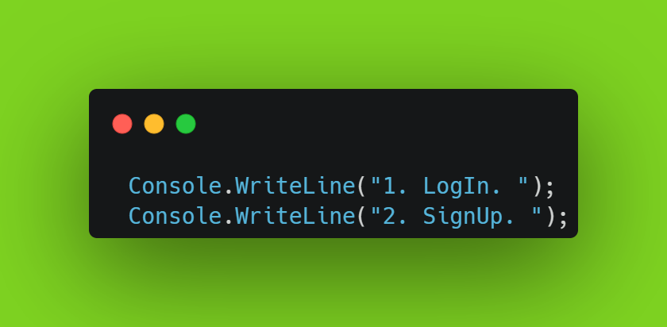
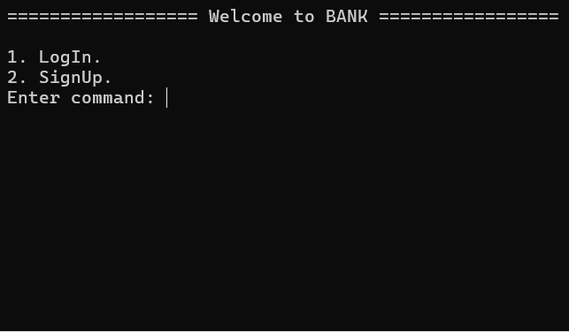
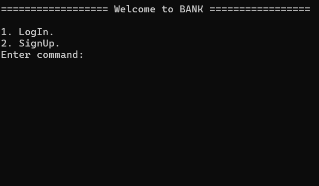
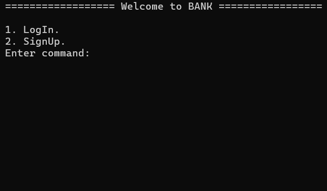

# Registry Department
In this section, you can complete the registration process to access the project.

## MENU

## 1. LogIn 
#### 1.1 In this section, it will work if the name and password you entered are in the database.

#### 1.2 If the name and password you entered are not found in the database, it will go to the SignUp section.

## 2. SignUp

#### 2.1 In this section, you can create a new one if your data is not found in the database.

#### 2.2 If you enter a password with less than 8 characters when creating an account, an error will occur.

